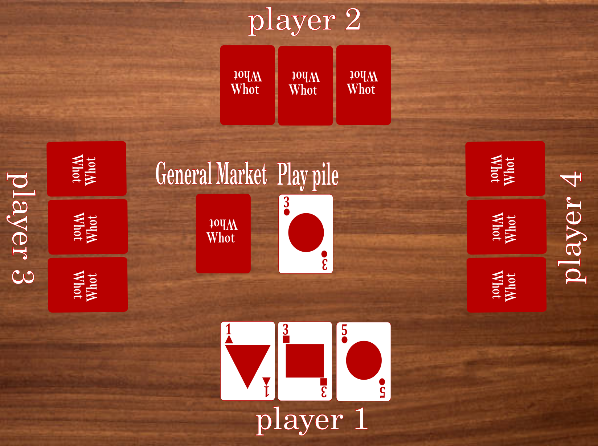
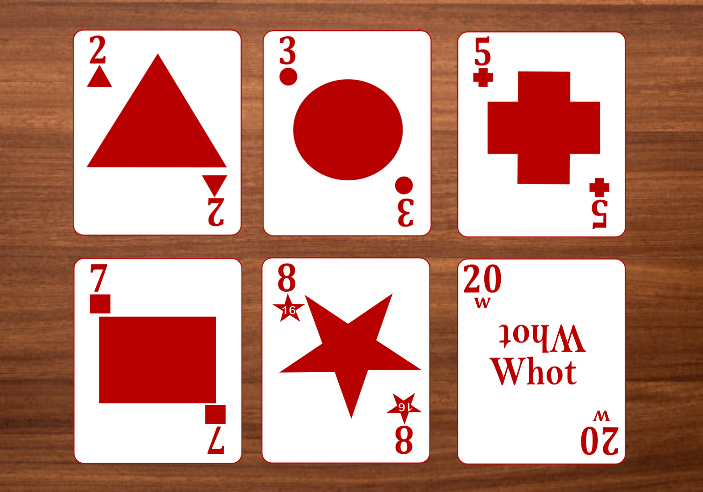

# Whot

An implementation of the [Whot](https://en.wikipedia.org/wiki/Whot!) game. The app is a web application that currently uses vanilla JS for the frontend and Python for the backend. The communication protocol used for the application is [WebSocket](https://en.wikipedia.org/wiki/WebSocket).

## Background 

Whot is a popular card game first developed by William Henry Storey in the 1930s. The popularity of the game grew in Britain before finding its way to Nigeria, where it became the most popular card game in the country.

## How it's played



The game of Whot consists of two or more players. Each player is dealt a certain number of cards at the beginning of the game. The player can only see their own card and can't see their opponents' cards.

There's a **play pile** where the user drops their card on, there's also a **general market** from which users draw new cards during game play.

The players take turns playing their card to the play pile. Any card a user drops on the play pile should be of the same suit or number as the current card on the pile. If they don't have any card of the same suit or number, the player has to go to the general market.

A winner is declared when one of the players no longer has any card at hand.

## Cards



The Whot card consists of 5 suits that come in the form of shapes:
- Cross
- Square (also known as Carpet)
- Star
- Circle (also known as Ball)
- Triangle (also known as Angle)

The cards of the suits are numbered, ranging from 1 to 14. There's also a special card called the **Whot Card** that belongs to the Whot suit, and its number is 20.

### Special Cards

In the original version of Whot, there was only one special card, the  **Whot Card** . This card could be placed on the pile at any time. When placed, the user can request a card of a particular suit of their choice. 

In the Nigerian version, extra special cards were introduced. These special cards were mostly designated based on their number, not suit. 


| Card        | Effect      | Explanation      |
| ----------- | ----------- | ---------------- |
| 1           | Hold on     | The current player can play again with a card of the same suit as the 1 card.           |
| 2           | Pick two    | The next play is asked to pick two cards from the general market. It can be defended with another card with the number 2. The picking of two cards is then transfered to the player after them.            |
| 5           | Pick three  | The next play is asked to pick 3 cards from the general market. It can be defended with another card with the number 5. The picking of three cards is then transfered to the player after them.             |
| 8           | Suspension  | The next player is told to abaddon their turn and give it to the player after them.             |
| 14          | Go Gen      | All players apart from the current player is made to draw a card from the general market.             |


## Usage

To use this you need `Python 3.11` or higher. Other lower versions of Python might work but I haven't tested them.

First, install the dependencies with this command:

```bash
pip install -r requirements.txt
```

Then run the server:

```bash
python3 server.py
```

To run the frontend you can use any webserver of your choice. I am using python's web server:

```bash
python -m http.server
```

The application would be running on `127.0.0.1:8000`.


## Contributions

This code base is open to contributions. To contribute, check out the [issues](https://github.com/EteimZ/whot/issues) of the repo. Pick an issue you want to resolve and drop a comment to express your interest in resolving the issue. If there's no issue, you can create an issue that you can resolve yourself or let someone else resolve it.

If you want to make contributions, first you have to fork the repo. Make your changes to your fork, then open a PR.

## Resources

Useful resources about the game of whot.
- Whot [Wikipedia page](https://en.wikipedia.org/wiki/Whot!).
- Whot game [rules](https://www.pagat.com/com/whot.html) from [pagat.com](https://en.wikipedia.org/wiki/Pagat.com).
- This [document](https://www.gamecatalog.org/rules/Storey+Co_Whot.pdf) that has the original whot rules from the 1930's.
